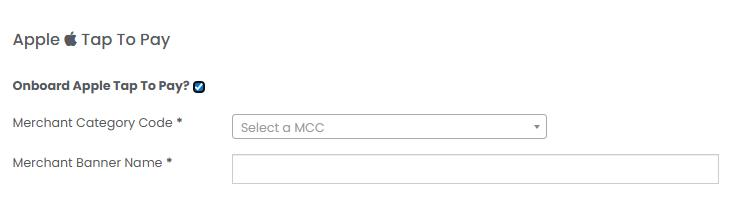
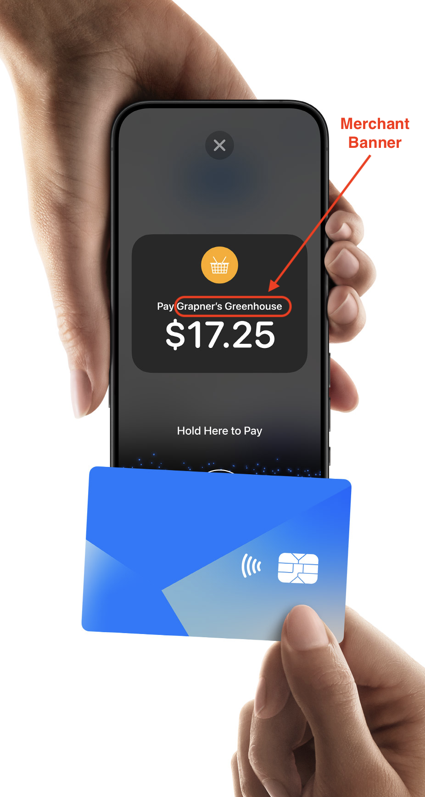
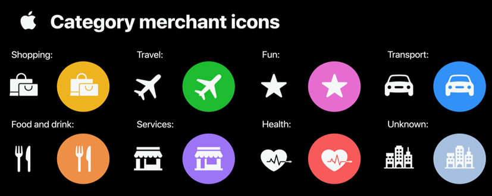
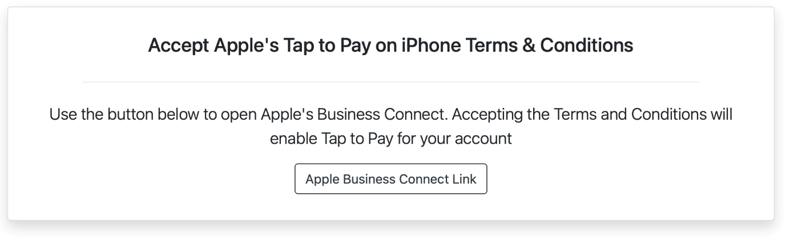
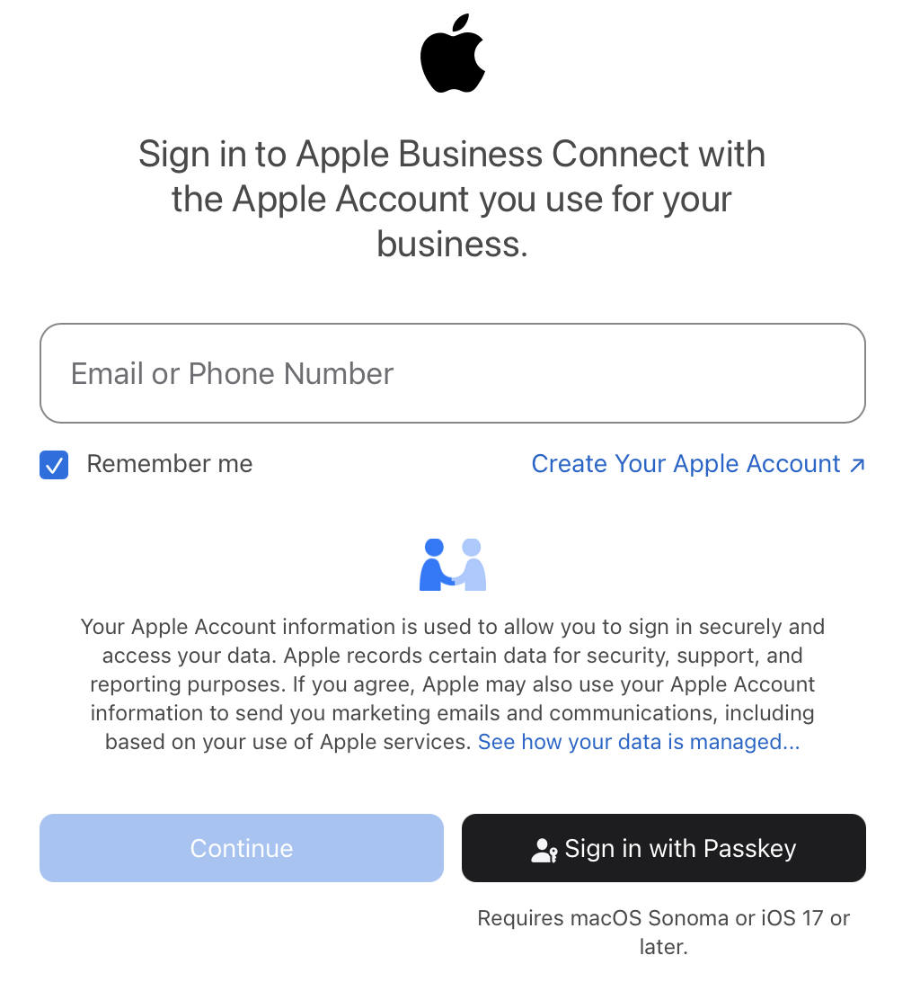

# MagTek Virtual Reader iOS SDK for Tap to Pay on iPhone QuickStart Guide

This guide provides the developer an overview of the steps needed to integrate the MagTek Virtual Reader iOS SDK for Tap to Pay on iPhone into their own mobile App. The documents focus on the MagTek Virtual Reader integration and related features and not the features of the Magensa Payment Protection Gateway (MPPG) or Unigate that are addressed in their respective documentation or online tools.

## You will need your MPPG credentials to successfully run transactions. If you do not have them, reach out to your MagTek Sales Professional.

## MagTek Virtual Reader iOS SDK

Please see the accompanying documents for how to include the MagTek Virtual Reader iOS SDK in your project.

D998200714-100 - MagTek Virtual Reader iOS SDK  
D998200715-100 - README MAGTEK  
D998200716-100 - MagTek Virtual Reader User Guide

## iOS App developer required steps

Get an entitlement from Apple for Tap to Pay on iPhone and configure your Xcode project accordingly.

1.  Before submitting an entitlement request, make sure you meet the following requirements:

    - You have an Apple Developer account at the **Organization** level.

    - You are the **Account Holder** for that Apple Developer account.

2.  [Complete this form](https://developer.apple.com/contact/request/contactless-payments) to get the entitlement.

3.  After your request is approved and you’ve received the entitlement for Tap to Pay on iPhone, follow Apple's instructions to [configure your Xcode project](https://developer.apple.com/documentation/proximityreader/setting-up-the-entitlement-for-tap-to-pay-on-iphone) to use it.

## Magensa Payment Protection Gateway Integration using MPPG v5 or newer via the Unigate API

When the Apple Token has been collected from the \`ProximityReader\`, a payment transaction request must be made to the Magensa Payment Protection Gateway.

Complete documentation on integrating can be found here:

[Unigate API integration documentation on Postman](https://unigate.developer.magtek.com)

An example SALE request using the \`AppleTapToPay\` data format is included for convenience.

For transaction types other than a SALE (for example a VOID or REFUND), your POS should record the response from the SALE, then use the MagTranID to make a \`ReferenceTransaction\` request. ReferenceTransaction class calls are identical whether using a physical, or virtual reader.

The URL used to make these requests depends on the Apple entitlement you have for your app.

Development entitlements should use SANDBOX on the device, and the Magensa SANDBOX environment.

Production entitlements should use PRODUCTION environment.

Please consult your solution architect for the correct API URL.

### Merchant MPPG credentials

To transact with the Magensa Payment Protection Gateway, the API requests will need to include the merchant MPPG credentials (as with any Magensa integration).

If new MPPG credentials are required, please make a request to your MagTek sales professional.

The app developer controls how MPPG credentials are managed. There are two options:

1.  The merchant holds their MPPG credentials, and enters them in the app.

2.  The reseller holds the MPPG credentials in their backend and applies them to requests made by the app. The merchant is not involved with MPPG credential management.

Reseller steps

To enable Tap to Pay on iPhone for an existing merchant via your reseller portal:

1.  Search for the merchant.

2.  Check the box to enable Tap to Pay on iPhone

3.  Add the required information for the MCC and banner (the banner is displayed within the app when taking a payment)

4.  Check whether to send an onboarding email to the merchant. The Merchant will receive an email from Magensa inviting them to accept the Apple terms & conditions.

For the best user experience, keep the “Merchant Banner” under 25 characters. It is displayed to the cardholder when they tap (see example image below).

> 
>
> 

 

## Merchant steps

Apple requires merchants to agree to the Apple Tap to Pay on iPhone terms and conditions. There are no exceptions available to this requirement. The Apple terms & conditions can be agreed to in either of two ways:

1.  In-app. They will need to be signed into an Apple account on the device. The device must check to see if the Magensa account is linked to an Apple account. If it is not, the device will open the terms and conditions in-app, and the merchant must agree.

2.  In-web. The reseller will trigger an email with a link to agree to the terms in the web.

In the case of the second option, the merchant will be directed to the Apple Business Connect portal. They will need to sign-in or sign-up, create a business profile, and accept the terms and conditions.

In-web (Enterprise Onboarding) consists of three main steps:

1.  Merchant receives an email with a link.

2.  Link opens a Magensa portal  
    

3.  The button in the Magensa portal opens Apple Business Connect  
    
