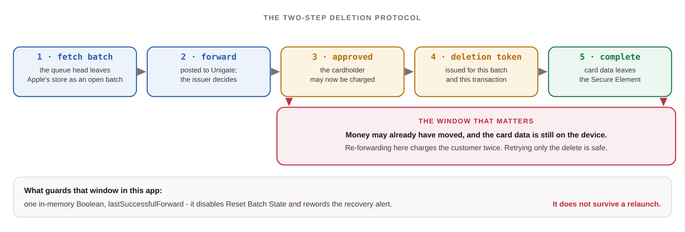
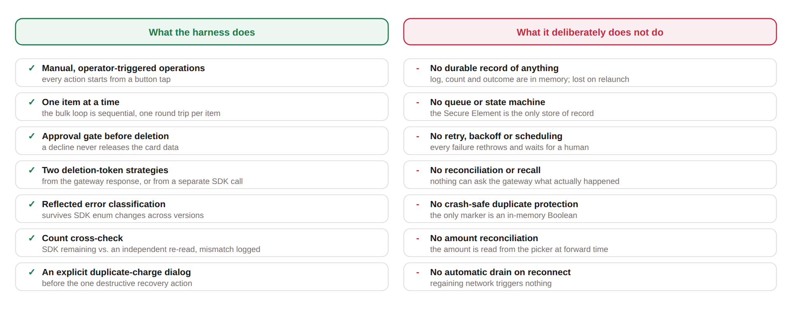
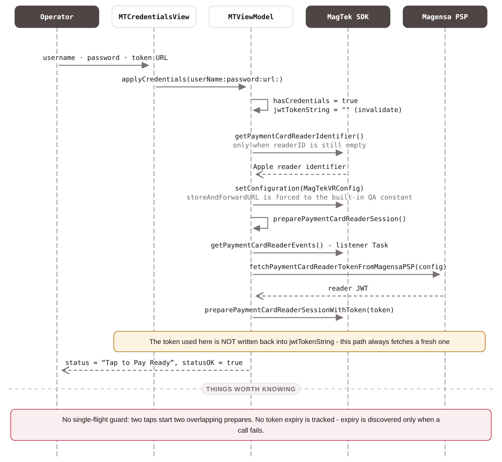
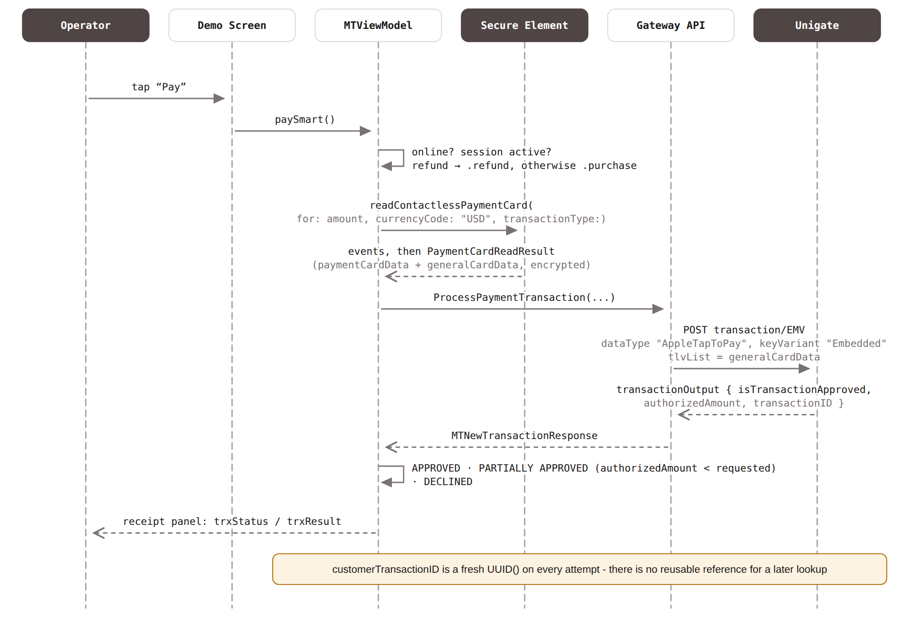
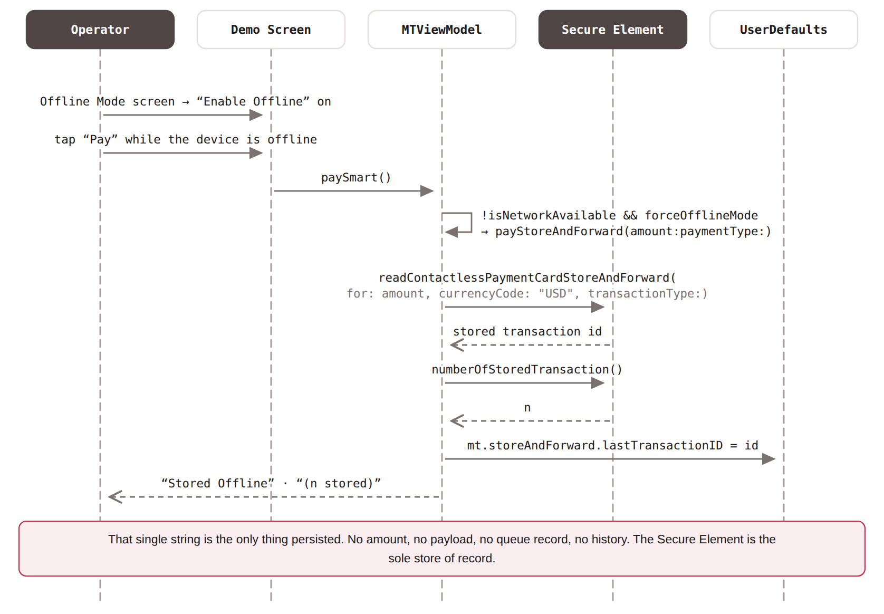
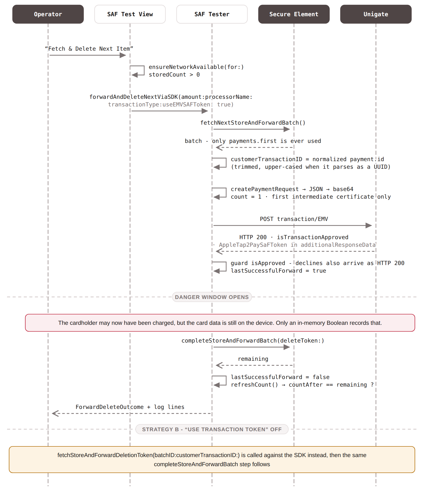
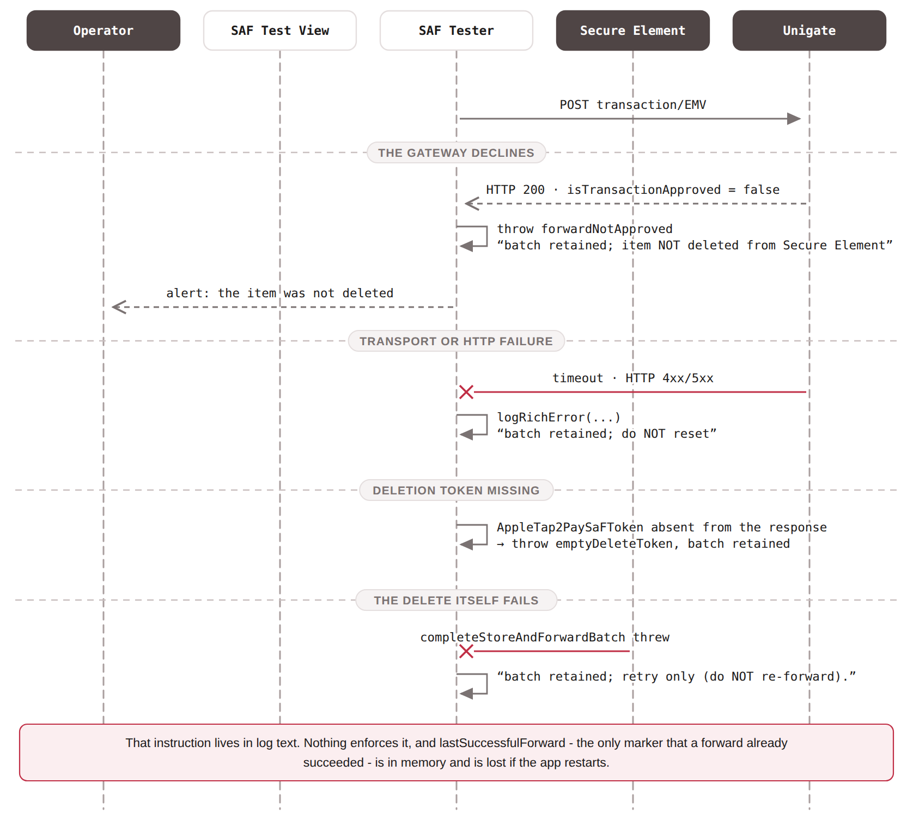
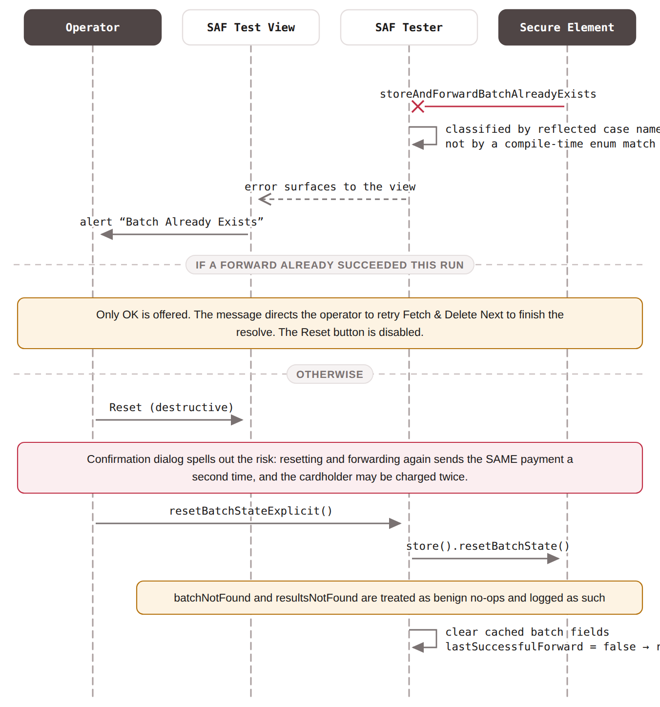

# MagTek Virtual Reader Demo

A developer tool to explore the **MagTek Virtual Reader SDK** integrated with the **Magensa Payment Protection Gateway**. The tool demonstrates functionality to perform iPhone **Tap to Pay** transactions online and offline.

## 01. Purpose of this Tool

> **Read this before anything else**
>
> This is an SDK integration tool to explore the API of the MagTek Virtual Reader SDK. It exists so Magensa integration partners can test MagTek Virtual Reader features interactively. It takes real payments against real card data. This is a tool intended for SDK discovery and not for deployment to a merchant.

The MagTek Virtual Reader Demo is an iOS app that wraps the MagTek Virtual Reader SDK - which in turn wraps Apple's **Tap to Pay on iPhone** - and posts the resulting encrypted card reads to the **Magensa Payment Protection Gateway**.

### What it does

- Configures the SDK from a username, password, and token URL entered in a sheet.
- Fetches a reader JWT from Magensa, links the merchant account, and prepares an Apple Tap to Pay session - each step individually invokable.
- Takes an online payment for an arbitrary amount, transaction type, and processor, and reports approved, partially approved, or declined.
- Captures a payment offline into Apple's Store and Forward store when the device has no network and offline mode is switched on.
- Forwards stored payments to Magensa one at a time and releases them from the device, under either of the two deletion-token strategies.
- Deletes stored payments without forwarding them, and recovers a stuck batch.
- Shows the reader token's expiry and remaining life, and an in-app filterable log.

### How this tool differs from the Magensa Payment Demo

There are two demo applications built on this SDK, and they serve different purposes.

|  | MagTek Virtual Reader Demo (this app) | Magensa Payment Demo |
|---|---|---|
| **Question it answers** | “What does each SDK call do, and what does it return?” | “What does a real merchant deployment have to get right?” |
| **Shape** | One screen of buttons, each mapped to a single SDK call. | A point-of-sale flow: catalog, cart, checkout, receipts, transaction history. |
| **Offline handling** | A manual harness. You press a button, one item is forwarded, and you read the log. | A persisted queue with a twelve-state machine, validated transitions, and an operator console. |
| **Persistence** | One string in `UserDefaults`. Nothing else survives a restart. | Two SwiftData stores holding pending payments, transaction history, and HTTP diagnostics. |
| **Failure recovery** | None. Every failure rethrows and waits for a human to decide. | Failure classification written before each request, gateway recall to resolve unknown outcomes, and deletion-only background recovery. |
| **Duplicate-charge protection** | One in-memory Boolean and a confirmation dialog. | Durable approval evidence on disk, so the safe action is derivable after a crash rather than remembered. |
| **Read it for** | Learning the API surface. Nothing is hidden behind abstraction. | Learning the architecture a deployment needs. Nothing is left to the operator's memory. |

Neither is a substitute for the other. This tool is the right place to discover what the SDK can do and to reproduce a specific call in isolation when something misbehaves in your own integration. The Payment Demo is the right reference once you know the calls and need to work out how to survive network loss, crashes, and ambiguous gateway responses.

## 02. What Tap to Pay on iPhone Is

Tap to Pay on iPhone is Apple's technology for accepting contactless payments directly on a supported iPhone, with no external card reader. The phone's NFC hardware performs the card read, and the payment data is encrypted inside the device's Secure Element before any application code can see it.

An app never handles a card number in this model. It asks the system to perform a read and receives an encrypted blob that only the payment service provider can decrypt. Everything this app does with card data is courier work.

### What Apple requires

- A **Magensa merchant account**. Magensa is a subsidiary of MagTek corporation, an Apple authorized payment service provider.
- The **Tap to Pay on iPhone entitlement**, provisioned against your developer account and bundle identifier. This project declares `com.apple.developer.proximity-reader.payment.acceptance`. See Apple's [Setting up the entitlement for Tap to Pay on iPhone](https://developer.apple.com/documentation/proximityreader/setting-up-the-entitlement-for-tap-to-pay-on-iphone).
- Integration with Apple's **ProximityReader** framework, which owns the customer-facing tap interface.
- **Merchant acceptance of Apple's terms**, presented by Apple on first device configuration.
- **Supported hardware and a real device.** Tap to Pay does not function in the iOS Simulator.

Reference: [Apple - Tap to Pay on iPhone](https://developer.apple.com/tap-to-pay/) and the [Human Interface Guidelines](https://developer.apple.com/design/human-interface-guidelines/tap-to-pay-on-iphone).

### What the MagTek SDK adds

The app does not call ProximityReader directly. `MagTekVirtualCardReader` wraps it and supplies the Magensa-specific pieces: fetching the reader token from Magensa PSP, linking the merchant account, and exposing Apple's Store and Forward operations for offline capture.

Apple provides the on-device store, the batch signing, and the deletion protocol; MagTek exposes them; Magensa authorizes a forwarded batch and can issue the deletion token that releases it.

## 03. Actors and Trust Boundaries

Five parties participate in a payment here. Knowing which one is authoritative for what makes the app's failure behavior much easier to read.

| Actor | Role | Authoritative for |
|---|---|---|
| **Apple / Secure Element** | Performs the card read, encrypts it, and for offline capture stores it in a FIFO queue the app cannot open. | Whether a stored payment still exists on the device, and the queue order. |
| **The app** | Drives the SDK, posts encrypted reads to the gateway, and prints what happened. | No durable state is kept. Use the *Magensa Payment Demo* for a state-management example. |
| **MagTek Virtual Reader SDK** | Wraps ProximityReader, obtains the Magensa reader token, exposes Store and Forward operations. | The mechanics of talking to the Secure Element. |
| **Magensa Payment Protection Gateway** | Decrypts the payment inside its HSM boundary, relays to the processor, returns the result, and can issue a Store and Forward deletion token. | Whether an authorization was received and what the result was. |
| **Processor and card issuer** | Approves or declines, and eventually moves money. | Whether the cardholder is charged. |

### The boundaries that matter

- **The app never sees a card number.** Card data crosses to Magensa as ciphertext.
- **The app cannot release stored card data by itself.** Deletion requires a token bound to a specific batch and transaction. This is deliberate - it stops an app quietly discarding a payment it was meant to submit. Note that Magensa processes transactions with a batch size of 1 item.
- **The app has no memory.** This is the single most important thing to internalise. After a restart, the app knows nothing about what it did before. The Secure Element and the gateway are the only places the truth lives.
- **Reachability is not gateway health.** The app monitors the network path with `NWPathMonitor`. It never probes Magensa. A device can be online and still fail every forward.

## 04. Terminology Map

Several names in this system look alike and mean different things.

### Identifiers

| Identifier | Issued by | What it identifies |
|---|---|---|
| **Stored payment ID** `payment.id` | Apple, at capture time | One stored payment read inside the Secure Element. The harness normalizes it - trimmed, and upper-cased when it parses as a UUID - and sends it as the `customerTransactionID`. |
| **Batch ID** `batch.id` | Apple, at fetch time | The currently open batch wrapping the queue head. Transient, and required when requesting a deletion token from the SDK. |
| `customerTransactionID` | The app | The merchant-side reference sent to Magensa. **Offline:** the normalized stored payment ID. **Online:** a fresh `UUID()` generated per attempt. |
| **Gateway transaction ID** | Magensa / processor | The processor's reference for the authorization. |
| `magTranID` | Magensa | Magensa's own record identifier, returned in the response and logged on failure. |

> **`customerTransactionID` is not an idempotency handle**
>
> It is a correlation identifier. Unigate does not guarantee idempotency, so resubmitting the same identifier may create a second financial transaction - which is precisely the risk the Reset Batch State dialog warns about. On the online path the value is a fresh UUID per attempt, so it cannot correlate anything at all afterwards.

### Tokens

| Token | Purpose and lifetime |
|---|---|
| **Reader JWT** | Issued by Magensa; authorizes this device's Tap to Pay reader session with Apple. Held in memory in `jwtTokenString`. **Its expiry is never checked by the app** - expiry is discovered only when a call fails. The Offline Mode screen does display the SDK's own expiry date and remaining seconds. Fresh tokens are valid for 48 hours. |
| **Store and Forward session / offline window** | Not a network token. Apple grants a device the ability to capture offline for roughly 24 hours after a successful *online* session preparation. When it lapses, offline capture stops working until the device goes online and prepares again. See Apple's [prepareStoreAndForward() documentation](https://developer.apple.com/documentation/proximityreader/paymentcardreader/preparestoreandforward()). |
| **Deletion token** | Single-use, bound to a batch and a transaction, and required to release stored card data. This app can obtain it two ways - see [Store and Forward Operations](#saf-ops). |

## 05. Setup and Your First Transaction

The goal is one successful test transaction on a real device.

### 1 · Before you open Xcode

- **Confirm region and PSP support** with your Magensa contact - Tap to Pay is available only in Apple-supported regions through PSPs Apple has enabled there.
- **Request the Tap to Pay on iPhone entitlement** from Apple, provisioned against your bundle identifier.
- **Obtain QA credentials** - a username and password - from your Magensa or Unigate technical contact.
- **Have a supported iPhone.** Tap to Pay does not run in the Simulator, and the whole app is gated to iOS 18.4.

### 2 · Project configuration

- Set the provisioned bundle identifier on the `MagTek Virtual Reader Demo` target. As shipped, the demo uses `com.magtek.SampleReaderApp`.
- Confirm the entitlements file is attached to the target and matches your provisioning profile.
- Endpoints live in `MTAPIEndpoint.swift` and `MTViewModel.swift`. Obtain the endpoint and payment processor information from your Magensa technical contact.
- Resolve the Swift package dependency: Atlantis (Atlantis is a testing aid for inspecting live traffic in Proxyman and is to be removed before release). Note that here it is guarded by `#if canImport(Atlantis)` rather than `#if DEBUG`, so it is compiled in and started by any build in which the package is present, Release included.

### 3 · First run

1. Launch on a real device. If no credentials are set, the credentials sheet appears automatically.
2. Enter the username, password, and token URL, then **Save**. This applies the configuration and starts a session preparation.
3. On the first device configuration, Apple presents its **merchant terms acceptance** flow. Complete it.
4. Watch the status line under the pickers. Success is **“Tap to Pay Ready”** in green, at which point the large **Pay** button appears.

> **The app ships with credentials compiled in**
>
> The source contains a default QA username and password as static constants, and they seed the credential fields on first launch. Treat them as sample values, replace them with your own, and do not carry them into any build you distribute.

### 4 · Your first online transaction

1. Choose a processor and a transaction type, and set an amount - the default is `2.00`.
2. Tap **Pay** and present a test card.
3. The result panel shows **APPROVED ✅**, **PARTIALLY APPROVED ℹ️**, or **DECLINED 🛑**, with the requested amount, the authorized amount, and the transaction number.

### 5 · Your first Store and Forward transaction

1. Open **CONFIGURATION → Offline Mode**. If it reports “Reader not available”, prepare the reader session on the main screen first - Apple's 24-hour offline window is granted by an online preparation.
2. Switch **Enable Offline** on, then close the sheet.
3. Put the device in Airplane Mode and tap **Pay**. The status becomes **“Stored Offline”** with a stored count.
4. Restore connectivity and reopen **Offline Mode**. Refresh the count - it should show your item.
5. Tap **Fetch & Delete Next Item**. The payment is forwarded, the result logged, and the card data released from the device.

### Assumptions this demo hard-codes

| Assumption | Detail |
|---|---|
| Currency | `"USD"` at both card-read call sites. No currency selection. |
| Environment | QA only. The transaction endpoint and the Store and Forward URL are constants; the latter overrides anything the user enters. |
| Amount on forward | Read from the on-screen picker *at forward time*, not from anything captured with the offline payment. |
| Minimum OS | iOS 18.4 for the whole app, so every Store and Forward path is always available. |

## 06. Walkthrough - An Online Payment

The ordinary path, in the order a developer would trace it.

1. **The operator taps Pay.** The button only appears once `statusOK` is true and a payment is not already running.
2. **Routing.** `paySmart()` reads the amount and maps the transaction-type picker onto Apple's type - `.refund` for a refund, otherwise `.purchase`. With a network path present and the session active, it calls `pay(amount)`; if the session is not active it runs the fuller `processTapToPayTransaction(amount)`, which links the account and configures a session first.
3. **The card is read.** `readContactlessPaymentCard(for:currencyCode:transactionType:)` is called with `"USD"`. Apple owns the customer-facing interface from here. A parallel task consumes the reader event stream and mirrors it into the status line, timing the `cardDetected` event specifically.
4. **The encrypted result is posted.** On a successful outcome the app takes `paymentCardData` and `generalCardData`, builds an `MTPaymentRequest`, and hands it to `PaymentGatewayServiceAPI.newPaymentRequest`, which posts to `transaction/EMV`.
5. **The response is classified.** Approved with a full authorized amount is **APPROVED**; approved for less than requested is **PARTIALLY APPROVED**; otherwise **DECLINED**. A non-success read outcome yields `DECLINED (Apple)` without any gateway call.
6. **The receipt panel appears** with the requested amount, the authorized amount, and the transaction number, and stays until the operator taps OK.

> **Two details worth knowing**
>
> The `customerTransactionID` sent to the gateway is a fresh `UUID()` generated inside the request builder on every attempt - nothing correlates a retry with an earlier one. And on the online path `generalCardData` is sent as `tlvList`, whereas the Store and Forward path sends an empty `tlvList` and puts everything in the encoded batch. The two request shapes are not interchangeable.

See [sequence diagram B](#vseq-online).

## 07. Walkthrough - Capturing a Payment Offline

Offline capture is reached only when three things are true at once: the device has no network path, **Enable Offline** is switched on, and Apple's offline window has not lapsed. If the device is offline and the toggle is off, the app simply reports `Offline: network unavailable` and does nothing.

1. `paySmart()` sees `!isNetworkAvailable && forceOfflineMode` and routes to `payStoreAndForward(amount:paymentType:)`.
2. The SDK is asked to read the card into Apple's store with `readContactlessPaymentCardStoreAndForward(for:currencyCode:transactionType:)`, again in USD.
3. On success the app immediately calls `numberOfStoredTransaction()` purely to build a `" (n stored)"` suffix for the status line.
4. The returned identifier is trimmed and written to `UserDefaults` under `mt.storeAndForward.lastTransactionID`.
5. The result panel shows **Stored Offline**.

> **What is not recorded**
>
> That single `UserDefaults` string is everything the app persists. The amount, the transaction type, the processor, the time of sale - none of it is kept. When the item is forwarded later, the amount and processor sent to the gateway are read from whatever the pickers happen to say *at that moment*, not from the sale. In a production system that gap is exactly what a persisted queue exists to close.

See [sequence diagram C](#vseq-capture).

## 08. Walkthrough - Forwarding a Stored Payment

Forwarding happens on the **Offline Mode** screen, one item at a time, and always because someone pressed a button. The core sequence is a two-step deletion protocol wrapped around a gateway call.



*The batch is opened, forwarded, and only then released. Between approval and completion the payment may already have been taken while the card data is still on the device - the one window where a mistake becomes a double charge.*

### Step by step

1. **Fetch.** `fetchNextStoreAndForwardBatch()` returns the queue head as an open batch. Only `payments.first` is ever used; if the batch is empty the harness calls `failStoreAndForwardBatch()` and stops.
2. **Identify.** The stored payment ID is normalized - trimmed, and upper-cased when it parses as a UUID - and becomes the `customerTransactionID`.
3. **Encode.** The batch is rebuilt as a `PaymentRequest` with `count` fixed at 1, exactly one payment, and **only the first intermediate certificate**; that JSON is base64-encoded and carried as `encryptedData.data`.
4. **Forward.** Posted to `transaction/EMV` with the amount, processor, and transaction type taken from the current UI pickers.
5. **Gate on approval.** Magensa answers HTTP 200 for declines too, so the `isTransactionApproved` flag is the only thing standing between a declined payment and deletion of the record. A decline throws, and the item stays on the device.
6. **Obtain a deletion token** - from the response, or from the SDK. See [Store and Forward Operations](#saf-ops).
7. **Complete.** `completeStoreAndForwardBatch(deleteToken:)` releases the card data and returns the remaining count.
8. **Cross-check.** The harness independently re-reads the stored count and compares it against the SDK's reported remaining. A mismatch is logged as `MISMATCH … - surface to back-end team` and reported in the outcome block with a ❌.

### Forwarding everything

**Fetch & Delete All Items** runs the same single-item routine in a sequential loop until the store reports no more results. There is no bulk endpoint at the gateway; items go up one at a time. If any item fails, the loop stops and rethrows, leaving the remainder on the device - and the alert says so.

### What every failure has in common

The batch is retained. The harness logs a one-line summary, dumps a rich error block, states explicitly whether the batch was kept, and rethrows. It never retries. The recovery instruction - most importantly `batch retained; retry only (do NOT re-forward)` - is text in the log, and following it is the operator's responsibility.

See [sequence diagram D](#vseq-forward) and [diagram E](#vseq-fail).

## 09. Duplicate Charges - What Protects You Here

This section is the one to read before letting anyone run this app against live cards.

The risk is structural, not a bug: a payment can be forwarded and approved, and the delete that should follow can fail. At that moment the cardholder may have been charged while the card data is still sitting on the device. If someone then forwards that same record again, the customer is charged twice.



*The harness is careful about the things it can see, and silent about the things it cannot. Everything in the right-hand column is a deliberate omission appropriate to a test bench and inappropriate to a deployment.*

### What actually protects the window

| Protection | How far it goes |
|---|---|
| **The approval gate** | Solid. A declined or non-approved forward never reaches the deletion step, so a record is never released without an answer. |
| **`lastSuccessfulForward`** | An in-memory Boolean, set on approval and cleared after a successful delete. While it is set, **Reset Batch State** is disabled and the “Batch Already Exists” alert offers only OK, directing the operator to retry the delete instead. **It does not survive a relaunch.** |
| **The confirmation dialog** | The clearest safeguard in the app. Reset Batch State cannot be triggered without reading a message that spells out, in plain language, that resetting and forwarding again may charge the cardholder twice. |
| **The log** | Advisory only. It states whether the batch was retained and whether a retry should re-forward or only re-delete. Nothing enforces it. |

### Where the protection ends

- **A crash or restart erases the only marker.** If the app dies between a successful forward and a successful delete, nothing on the device records that the payment was already sent. The next operator sees a stored item and a Reset button that is no longer disabled.
- **There is no way to ask the gateway.** No recall, no lookup by `customerTransactionID`, no void. Ambiguity cannot be resolved from inside the app.
- **There is no ledger of forwarded identifiers.** Nothing detects that a given stored payment was already submitted.
- **The count cross-check is observational.** A mismatch between the SDK's remaining count and an independent re-read is logged and shown, but nothing acts on it.

> **Operating rule**
>
> If a forward succeeded and the delete did not, **retry only the delete** - tap Fetch & Delete Next again, which will complete the resolve for the already-forwarded batch. Do not use Reset Batch State. Reset is for one situation only: a fetch failing with `storeAndForwardBatchAlreadyExists` when nothing has been successfully forwarded yet in this run. If you cannot be certain which case you are in - for example after an app restart - treat it as unresolved and check the transaction at the gateway before touching anything.

See [sequence diagram F](#vseq-reset).

## 10. Magensa Unigate API

The app talks to exactly **one** gateway endpoint. Everything - online payments and forwarded offline payments alike - goes to the same place, differing only in what is carried inside the request.

| Method | Path | Purpose |
|---|---|---|
| `POST` | `transaction/EMV` | Authorize an encrypted payment. The only endpoint `MTAPIEndpoint` defines. |
| `-` | `AppleTapToPayToken/PaymentCardReader` | Reader JWT, called by the SDK rather than by app code. Editable in the credentials sheet. |
| `-` | `AppleTapToPayToken/StoreAndForward` | Store and Forward session endpoint, used by the SDK. Hard-coded and forced over any user-supplied value. |

Authentication is HTTP Basic, built per request from the configured username and password. The base URL is a constant pointing at the QA host.

### Two request shapes, one endpoint

This is the detail most likely to trip up an integrator reading the code for the first time. Both paths post the same envelope, but they fill it differently.

| Field | Online payment | Forwarded offline payment |
|---|---|---|
| `encryptedData.dataType` | `"AppleTapToPay"` | `"AppleTapToPay"` |
| `encryptedData.keyVariant` | `"Embedded"` | `"Embedded"` |
| `encryptedData.data` | the read's `paymentCardData` | base64 of a JSON `PaymentRequest` wrapping the whole signed batch |
| `encryptedData.ksn` | `null` | `null` - explicitly encoded, not omitted |
| `dataInput.tlvList` | the read's `generalCardData` | `""` - the card data is inside the encoded batch |
| `dataInput.paymentMode` | `"EMV"` | `"EMV"` |
| `customerTransactionID` | a fresh `UUID()` per attempt | the normalized stored payment ID |

### The Store and Forward payload

```
{
  "id":                      "<batch id>",
  "count":                   1,
  "intermediateCertificate": [ "<first element only>" ],
  "leafCertificate":         "…",
  "signature":               "<batch signature>",
  "payments": [ {
      "id":              "<stored payment id>",
      "generalCardData": "…",
      "paymentCardData": "…",
      "signature":       "…"
  } ]
}
```

Serialized with sorted keys and pretty printing, then base64-encoded into `encryptedData.data`. `count` is fixed at 1 and the payments array always holds exactly one element, matching the single payment taken from the batch - the signature covers the batch as a whole, so the shape must not be altered.

### Response handling

An online authorization is considered usable only when the transaction output, data output, transaction ID, approval flag, and masked PAN are all present; a response missing any of them returns `nil` and the app reports an authorization failure. Approval is then compared against the requested amount to distinguish full from partial approval.

> **A decline is an HTTP 200**
>
> Magensa answers 200 for declines and processor-side rejections. On the Store and Forward path the `isTransactionApproved` flag is therefore the only thing preventing a declined payment's card data from being deleted. When it is false, the harness assembles a diagnostic summary from `transactionStatus`, `transactionMessage`, `error`, `transactionID`, `magTranID`, and `traceID` - the only signal the gateway gives.

## 11. MagTek Virtual Reader SDK

The app never calls `ProximityReader` directly for payments. `MagTekVirtualCardReader`, configured with a `MagTekVRConfig`, is the seam.

### Preparation sequence

1. Resolve the Apple reader identifier - only when it is not already set.
2. Build the configuration and apply it to the reader. The Store and Forward URL is always forced to the built-in constant, whatever the user typed.
3. Start consuming the reader event stream so progress reaches the status line.
4. Fetch a reader JWT from Magensa PSP.
5. Link the merchant account if it is not already linked.
6. Prepare the Apple session with the token.

Individual buttons on the main screen invoke steps 4, 5, and 6 separately, which is the point of the app - you can watch each one succeed or fail on its own.

> **Preparation is not single-flight**
>
> There is no in-flight guard, no task de-duplication, and no isolation of the token. Two taps on Prepare start two overlapping preparations, and each spawns another event-stream listener that is never canceled. In a production integration this is the first thing to add.

### Token handling

| Behavior | Where |
|---|---|
| **Always fetch and cache** | `fetchToken()` overwrites the cached JWT unconditionally. |
| **Always fetch, do not cache** | `preparePaymentCardReaderSession()` fetches a fresh token for the prepare and discards it afterwards. |
| **Fetch only if empty** | `linkAccount()` and `preparePaymentCardReaderSessionWithToken()`. |
| **Invalidate** | Applying credentials clears the cached token so the next prepare re-fetches under the new identity. |

> **The app never checks token expiry**
>
> The JWT is stored as a plain string. It is never decoded, no `exp` claim is inspected, no issue time is recorded, and nothing refreshes it on a timer. Expiry is discovered reactively, when a call fails with a token error - and neither error handler re-fetches or retries; both only log and set an error string. The one place expiry is visible is the Offline Mode screen, which reads the SDK's own expiration date and seconds-remaining and displays them.

### Reader events

Progress is pull-based: the SDK exposes an async sequence of reader events which the app consumes and republishes into the status line. The `cardDetected` event is timed specifically, so the log records how long the customer took to present a card.

### Error surface

A single handler matches, in order: MagTek reader errors, MagTek token request errors, then Apple's `PaymentCardReaderError` - with named cases for account not linked, prepare failed, invalid reader token, unsupported OS version, device banned (including the ban expiry date), not ready, reader busy, prepare expired, account already linked, linking failed or canceled, token expired, unsupported, not allowed, and background request not allowed - before falling back to a generic message. Read errors are handled separately and are log-only: token expired, no reader session, read not allowed, and read not allowed during a call.

## 12. SDK API Reference

The complete public surface of `MagTekVirtualReader.xcframework`, taken from the framework's Swift module interface. Every entry notes whether this demo exercises it, because a fair amount of the SDK is not reachable from the app's buttons.

> **How to read the availability marker**
>
> _used_ means the demo calls it somewhere. _unused_ means it is part of the public API but the demo never touches it - worth knowing about when you build your own integration.

### Configuration

**`MagTekVRConfig`**  
_struct · used_

The reader configuration: `userName`, `password`, `url` (the token endpoint), `storeAndForwardURL`, and an optional `readerID`. Two initializers - one that takes the Store and Forward URL, one that does not. `validate()` throws if the configuration is unusable.

---

**`MagTekJWTConfiguration`**  
_struct · unused_

An alternative configuration carrier for token requests, with a mutating `setConfiguration(userName:password:url:readerID:)` and its own `validate()`. Serves the same purpose as the reader configuration for JWT acquisition.

### MagTekVirtualCardReader - lifecycle and properties

**`init(config: MagTekVRConfig, returnReadResultImmediately: Bool = false)`**  
_initializer · used_

Creates the reader from a configuration. The second parameter defaults to `false`; when true the SDK returns the card read without waiting for the full result sequence.

---

**`static func getSDKVersion() -> String`**  
_static · used_

The SDK's version string. The demo stamps it into the device-info log entry at startup.

---

**`static func enableLogger(_ enabled: Bool, _ logHandler: ((String) -> Void)? = nil)`**  
_static · unused_

Turns the SDK's own logging on or off and optionally routes each line to a handler closure. Useful for capturing SDK-internal diagnostics alongside your own log.

---

**`var paymentCardReader: PaymentCardReader?`**  
_property · used_

The underlying Apple reader instance. The Store and Forward harness uses it to reach Apple's payment card reader store directly.

---

**`var cardReaderID: String?`**  
_property · unused_

The reader identifier currently held by the SDK.

---

**`var events: AsyncStream<PaymentCardReader.Event>?`**  
_property · unused_

The reader event stream exposed as a property. The demo uses the method form below instead.

---

**`var updateCardReaderSessionIfExpired: Bool`**  
_property · unused_

When set, the SDK refreshes an expired card reader session automatically rather than failing the call. Directly relevant to the token-expiry gap described in [MagTek Virtual Reader SDK](#sdk).

### Capability and identity

**`func isTapToPaySupported() -> Bool`**  
_used_

Whether this device and OS can accept Tap to Pay at all. The demo gates its Pay button on this and shows “Use Other Payment Interface” when it is false.

---

**`func getPaymentCardReaderIdentifier() async throws -> String?`**  
_used_

Resolves Apple's reader identifier for this device. Required before a configuration can be completed.

---

**`func setConfiguration(_ config: MagTekVRConfig) throws`**  
_used_

Applies a configuration to the reader.

---

**`func getPaymentCardReaderEvents() -> AsyncStream<PaymentCardReader.Event>`**  
_used_

An async sequence of reader events - ready for tap, card detected, remove card, read completed, and so on. The demo consumes it in four separate places to drive its status line.

### Token

**`func fetchPaymentCardReaderTokenFromMagensaPSP(_ config: MagTekVRConfig, terminalProfileId: String? = nil, duration: Int? = nil) async throws -> String`**  
_used_

Requests a reader JWT from Magensa for the supplied configuration. The optional terminal profile identifier and duration let you scope the token; the demo passes neither.

---

**`func isTokenExpired() async -> Bool`**  
_unused_

Whether the currently held token has expired. This is the check the demo never performs.

---

**`func paymentCardReaderTokenExpirationDate() -> Date?`**  
_used_

The token's expiry as a date. Displayed on the Offline Mode screen.

---

**`func paymentCardReaderTokenSecondsRemaining() -> TimeInterval?`**  
_used_

Remaining token life in seconds. Drives the countdown on the Offline Mode screen.

### Merchant account linking

**`func isMerchantAccountLinked() async throws -> Bool`**  
_iOS 17+ · used_

Whether the merchant account is already linked on this device.

---

**`func isMerchantAccountLinked(token: String) async throws -> Bool`**  
_iOS 17+ · unused_

The same check performed against a specific token rather than the cached one.

---

**`func linkMerchantAccount() async throws`**  
_used_

Links the merchant account using the SDK's own token handling. Presents Apple's terms acceptance flow on first use.

---

**`func linkMerchantAccountWithToken(_ tokenString: String) async throws`**  
_used_

Links using a token you already hold. This is the variant the demo's Link Merchant Account button calls.

### Session and payment

**`func configurePaymentCardReaderSession(progressHandler: ((Int) -> Void)? = nil) async throws`**  
_used_

Performs the fuller first-run configuration, reporting progress as an integer percentage through the optional handler. The demo surfaces it as “Configuring - n%”.

---

**`func preparePaymentCardReaderSessionWithToken(_ tokenString: String) async throws`**  
_used_

Prepares an Apple Tap to Pay session with a reader JWT. This is the call that makes the reader ready to take a tap, and the one that grants the 24-hour offline capture window.

---

**`func readContactlessPaymentCard(for amount: Decimal, currencyCode: String, transactionType: PaymentTransactionType) async throws -> PaymentCardReadResult`**  
_used_

Reads a contactless card online and returns the encrypted result. Apple owns the customer-facing interface for the duration of the read.

### Store and Forward - iOS 18.4 and later

All of the following live in an availability-gated extension on the reader.

**`var hasActiveStoreAndForwardSession: Bool`**  
_property · unused_

Whether an offline session is currently active.

---

**`func isStoreAndForwardAvailable() async -> Bool`**  
_unused_

Whether offline capture is available right now - the cleanest pre-check before offering an offline sale, rather than inferring availability from a failed capture.

---

**`func readContactlessPaymentCardStoreAndForward(for amount: Decimal, currencyCode: String, transactionType: PaymentTransactionType) async throws -> PaymentCardReadResult`**  
_used_

Reads a card into Apple's Store and Forward store instead of authorizing it. This is the offline capture call.

---

**`func cancelPreviousStoreAndForwardTransaction() async throws`**  
_unused_

Cancels a previous offline transaction that did not complete.

---

**`func numberOfStoredTransaction() async throws -> Int`**  
_used_

How many payments are currently held in the Secure Element.

---

**`func getStoredTransactions(limit: Int = 0) async throws -> [StoreAndForwardBatch.StoredPaymentCardReadResult]`**  
_unused_

Inspects the stored payments without opening a batch. A limit of 0 returns everything. This is the call an integration would use to build an offline queue view.

---

**`func fetchNextStoreAndForwardBatch() async throws -> StoreAndForwardBatch?`**  
_used_

Opens the queue head as a signed batch. Returns `nil` when the store is empty.

---

**`func fetchAllStorePaymentCardReaderResultBatch() async throws -> StoreAndForwardBatch?`**  
_used_

Opens every stored payment as one batch, for bulk inspection or bulk deletion.

---

**`func fetchStoreAndForwardDeletionToken(batchID: String, customerTransactionID: String) async throws -> String`**  
_used_

Requests a deletion token bound to a specific batch and transaction - the first half of the two-step deletion protocol.

---

**`func completeStoreAndForwardBatch(deleteToken: String) async throws -> Int`**  
_used_

Releases the open batch using a deletion token and returns the remaining stored count. The second half of the protocol, and the point at which card data leaves the device.

---

**`func failStoreAndForwardBatch() async throws`**  
_used_

Marks the open batch as failed and closes it without deleting anything, freeing the store so the next fetch can proceed.

---

**`func deleteAllStorePaymentCardReaderResultBatch(_ batch: StoreAndForwardBatch) async throws -> StoreAndForwardBulkResult`**  
_used_

Deletes an entire fetched batch in one operation.

---

**`func fetchAllStorePaymentCardReaderResultBatchAndDeleteAll() async throws -> StoreAndForwardBulkResult?`**  
_unused_

Fetch-everything-and-delete-everything in a single call. The demo performs the two steps separately.

> **Capabilities worth adopting**
>
> Four unused members map directly onto gaps described elsewhere in this guide. `isTokenExpired()` and `updateCardReaderSessionIfExpired` address the missing token-expiry policy. `isStoreAndForwardAvailable()` is a cleaner pre-check than inferring availability from a failed capture. And `getStoredTransactions(limit:)` would let an integration show the operator what is actually queued without opening a batch - the foundation of a real offline queue view.

## 13. Store and Forward Operations Reference

Every Store and Forward operation available in the app, what it wraps, and what it costs you if it goes wrong.

| Operation | What it does | If it fails |
|---|---|---|
| **Refresh count** | Reads the number of stored transactions from the Secure Element. | Nothing changes. |
| **Fetch & Delete Next Item** | Forwards the queue head to Magensa and, on approval, releases it from the device. | The batch is retained. Read the log before retrying. |
| **Fetch & Delete All Items** | Repeats the above sequentially until the store is empty. | Stops at the first failure; the remainder stays on the device. |
| **Delete Next Item** | Obtains a deletion token from the SDK and releases the head *without forwarding it*. The sale is abandoned. | The item remains. |
| **Delete All Items** | Fetches the full result batch and deletes it wholesale. On any error it first fails the active batch, then rethrows. | Partial state is possible; re-read the count. |
| **Reset Batch State** | Clears a stuck open batch so the head can be fetched again. Guarded by a confirmation dialog and disabled after a successful forward. | Batch-not-found and results-not-found are treated as benign no-ops. |

> **Delete means abandon**
>
> Delete Next and Delete All discard a captured payment without ever asking for authorization. The merchant simply does not get paid for that sale. Neither button presents a confirmation before executing - the only dialog they show is a result notice afterwards.

### The two deletion-token strategies

Releasing a stored record requires a token bound to that batch and transaction. The app can obtain it two ways, selected by the **Use Transaction Token** switch.

**From the forward response _default_**  
Magensa returns `AppleTap2PaySaFToken` in the response's additional data, alongside the authorization. One round trip instead of two. If the field is missing or empty the harness throws and retains the batch.

**From the SDK**  
A separate call asks the SDK for a deletion token for the batch ID and customer transaction ID. This is also the path used by **Delete Next Item**, which has no forward response to draw from.

Both strategies converge on the same completion call, and the log records only the token's *length* - never its value.

## 14. Sequence Diagrams

Six diagrams covering everything the app can do: bringing a reader session up, taking a payment online, capturing one offline, forwarding a stored payment under both deletion-token strategies, what happens when any of that fails, and how a stuck batch is recovered.

### A. Session preparation

From credentials to a reader session that can take a payment. This runs at launch and again whenever credentials change.



### B. Online payment

The ordinary path. One tap, one gateway round trip, an answer within seconds.



### C. Offline capture

What happens when the device has no network and offline mode is switched on. Note how little is recorded.



### D. Forward and delete - token from the response

The default strategy, selected by the “Use Transaction Token” switch. The gateway returns the deletion token in the same response as the authorization, saving a round trip.



### E. Failure branches

Every failure rethrows immediately and leaves the batch on the device. What happens next depends entirely on the operator reading the log.



### F. Batch recovery - Reset Batch State

The escape hatch for a stuck batch, and the one place in the app that names duplicate-charge risk out loud.



## 15. Glossary

| Term | Meaning |
|---|---|
| **SAF** | Store and Forward - capturing a card payment for deferred authorization. |
| **Secure Element** | The tamper-resistant hardware where Apple retains captured Store and Forward payments. Its queue is first-in-first-out and permits one open batch at a time. |
| **Batch** | A unit of one or more stored payments fetched as a whole, carrying a signature that protects the integrity of its contents. Signed is not authorized. |
| **Open batch** | A batch that has been fetched but not yet completed or failed. While one is open, another cannot be fetched - the source of the “batch already exists” condition. |
| **Deletion token** | A single-use credential, bound to a batch and a transaction, required to release stored card data. Available from the gateway response or from the SDK. |
| **Device capture** | Storing an encrypted card read on the device. Not an approval, and distinct from financial capture. |
| **Financial capture** | Confirming an authorization for collection. Not performed by this app. |
| **Settlement** | The batch process in which funds actually move. |
| **Offline window** | Apple's roughly 24-hour permission to capture offline, granted by a successful online session preparation. Not a cached network token. |
| **Reader JWT** | The Magensa-issued token that authorizes this device's Tap to Pay reader session. Held in memory; expiry not tracked by the app. |
| **`customerTransactionID`** | The merchant-side reference sent to the gateway. A correlation identifier - it does not make resubmission safe. |
| **`magTranID`** | Magensa's own identifier for a transaction, returned in the response. |
| **Unigate** | Magensa's REST payment gateway. |
| **Partial approval** | The issuer approved less than the requested amount. Detected on the online path only, by comparing the authorized amount against the request. |

---

**MagTek Virtual Reader Demo - Technical Documentation.** Written from the source of the MagTek Virtual Reader Demo application.

© MagTek, Inc.
