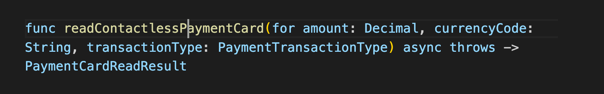

- MagTek Virtual Reader iOS SDK

  - [Overview](#overview)

    - [Key Components](#key-components)

    - [What's Included](#whats-included)

    - [Developer Workflow](#developer-workflow)

  - [Structure: MagTekVRConfig](#structure-magtekvrconfig)

    - [Initializers](#initializers)

    - [Instance Properties](#instance-properties)

    - [Instance Methods](#instance-methods)

  - [Class: MagTekVirtualReader](#class-magtekvirtualreader)

    - Initializers

    - Instance Properties

    - Instance Methods

    - [Type Methods](#type-methods)

  - [Terms and Conditions](#terms-and-conditions)

  - [License](#license)

  - [Build](#build)

# Overview

> The MagTek Virtual Reader iOS SDK enables applications to accept secure contactless payments directly on an iPhone XS or later running iOS 17.4 or later. With this SDK, the iPhone itself acts as a *virtual reader*—no external hardware is required. This SDK manages secure NFC access, merchant authentication, token handling, and event monitoring so developers can work with the device as if it were a traditional MagTek card reader.

## Key Components

- **MagTekVRConfig** – Holds account configuration values such as userName, password, url, and optional readerID. A MPPG v5 Unigate Pilot account is required. If you don’t have a pilot account, please contact your MagTek Sales Professional to have one created.

- **MagTekVirtualReader** – The main reader class that provides methods to configure sessions, link merchant accounts, check device compatibility, and read contactless cards.

## What's Included

> This API reference covers:

- Initializers, instance properties, and methods for **MagTekVRConfig** and **MagTekVirtualReader**.

- Utility methods for logging and SDK version tracking.

- Error handling for merchant linking, token management, and reader sessions.

- Guidance on checking Tap to Pay availability and device compatibility.

## Developer Workflow

> The recommended integration flow is: **Configuration → Merchant Linking → Session Preparation → Card Reading**
>
> By following this sequence, developers can confidently integrate Tap to Pay on iPhone functionality into their payment applications using MagTek’s Virtual Reader iOS SDK.

# Structure: MagTekVRConfig

> MPPG credentials (MPPG username, MPPG password and MPPG CustomerCode).

##  Initializers

##  Instance Properties

- let password: String

> Password for this account.

- var readerID: String?

> Unique identifier of the MagTek Virtual Reader on a specific iPhone.

- let url: String

> URL to the JWT Token endpoint.

- let userName: String

> Username is composed with MPPG CustomerCode/MPPG Username.

## Instance Methods

##  

> Validates that all configuration properties are not empty.

Class: MagTekVirtualReader

## 

##  Initializers 

Instantiate a MagTek Virtual Reader class with Tap to Pay configuration data.

# Instance Properties

# 

- var cardReaderID: String?

> Unique identifier of the MagTek Virtual Reader on a specific iPhone.

- var events: AsyncStream\<PaymentCardReader.Event\>?

> A stream of events you receive indicating the activities of the card reader.

- var paymentCardReader: PaymentCardReader? PaymentCardReader object for advanced operations.

- var updateCardReaderSessionIfExpired: Bool true for automatic renewal of the token if it expires.

# Instance Methods 

>   
> Configure Payment Card Reader session.
>
>   
> Fetch Payment Card Reader token for transaction.
>
> 

Retrieve a stream of events you receive indicating the activities of the Payment Card Reader.

> 

The unique identifier for this Payment Card Reader.

Check if the merchant account is linked to card reader.

> 
>
> Check merchant account linking state.
>
> 
>
> Boolean value that indicates whether Tap to Pay is available on the current device.
>
> 

Check if token expired or not.

> 

Link to a merchant’s account.

> 

Link merchant account with given token.

> 
>
> Initialize a Payment Card Reader Session.

Read contactless payment card.

> 
>
> Update MPPG credentials (MPPG username & MPPG password) for card reader.

# Type Methods

> Enable/disable the internal logger. Default: false.

> Get current SDK version number string.

# Terms and Conditions

> [Terms and Conditions](https://www.magtek.com/about/policy?tab=terms)

# License

> [License](https://www.magtek.com/about/policy?tab=software)

# Build

> PN1000009873
