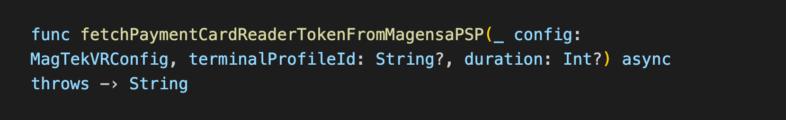
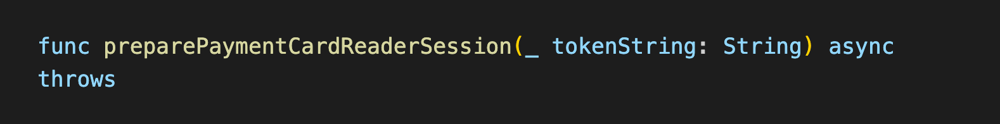
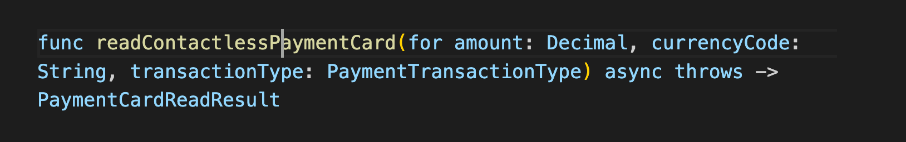
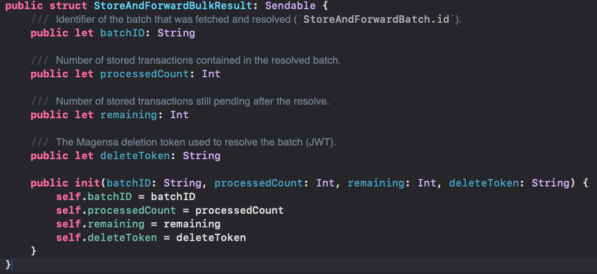
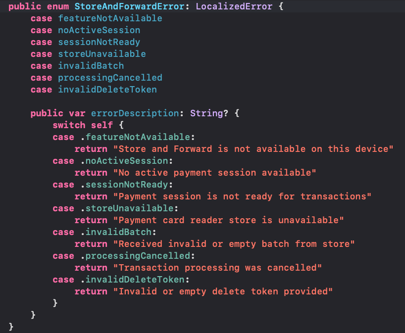
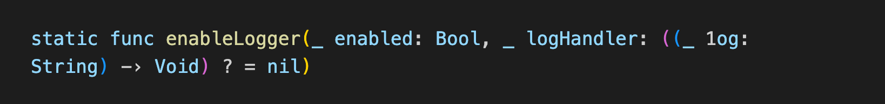

# MagTek Virtual Reader iOS SDK

**Document:** D998200714101

## Table of Contents

- [Overview](#overview)
  - [Key Components](#key-components)
  - [What's Included](#whats-included)
  - [Developer Workflow](#developer-workflow)
- [Structure: MagTekVRConfig](#structure-magtekvrconfig)
  - [Initializers](#initializers)
  - [Instance Properties](#instance-properties)
  - [Instance Methods](#instance-methods)
- [Class: MagTekVirtualReader](#class-magtekvirtualreader)
  - [Initializers](#initializers-1)
  - [Instance Properties](#instance-properties-1)
  - [Instance Methods](#instance-methods-1)
  - [Store and Forward Methods](#store-and-forward-methods)
  - [Store and Forward Models](#store-and-forward-models)
  - [Type Methods](#type-methods)
- [Terms and Conditions](#terms-and-conditions)
- [License](#license)
- [Build](#build)

---

## Overview

The MagTek Virtual Reader iOS SDK enables applications to accept secure contactless payments directly on an iPhone XS or later running iOS 17.4 or later. With this SDK, the iPhone itself acts as a *virtual reader*—no external hardware is required. This SDK manages secure NFC access, merchant authentication, token handling, and event monitoring so developers can work with the device as if it were a traditional MagTek card reader.

### Key Components

- **MagTekVRConfig** – Holds account configuration values such as `userName`, `password`, `url`, and optional `readerID`. A MPPG v5 Unigate Pilot account is required. If you don't have a pilot account, please contact your MagTek Sales Professional to have one created.
- **MagTekVirtualReader** – The main reader class that provides methods to configure sessions, link merchant accounts, check device compatibility, and read contactless cards.

### What's Included

This API reference covers:

- Initializers, instance properties, and methods for **MagTekVRConfig** and **MagTekVirtualReader**.
- Utility methods for logging and SDK version tracking.
- Error handling for merchant linking, token management, and reader sessions.
- Guidance on checking Tap to Pay availability and device compatibility.

### Developer Workflow

The recommended integration flow is: **Configuration → Merchant Linking → Session Preparation → Card Reading**

By following this sequence, developers can confidently integrate Tap to Pay on iPhone functionality into their payment applications using MagTek's Virtual Reader iOS SDK.

---

## Structure: MagTekVRConfig

MPPG credentials (MPPG username, MPPG password and MPPG CustomerCode).


```swift
struct MagTekVRConfig()
```

### Initializers


```swift
init(username: String, password: String, url: String, readerID: String?)
```

### Instance Properties

```swift
let password: String
```
Password for this account.

```swift
var readerID: String?
```
Unique identifier of the MagTek Virtual Reader on a specific iPhone.

```swift
let storeAndForwardURL: String
```
URL to the Store and Forward deletion-token endpoint. Required for Store and Forward; leave empty if the feature is not used.

```swift
let url: String
```
URL to the JWT Token endpoint.

```swift
let userName: String
```
Username is composed with MPPG CustomerCode/MPPG Username.

### Instance Methods


```swift
func validate() throws
```
Validates that all configuration properties are not empty.

---

## Class: MagTekVirtualReader


```swift
class MagTekVirtualReader()
```

### Initializers


```swift
init(config: MagTekVRConfig)
```
Instantiate a MagTek Virtual Reader class with Tap to Pay configuration data.

### Instance Properties

```swift
var cardReaderID: String?
```
Unique identifier of the MagTek Virtual Reader on a specific iPhone.

```swift
var events: AsyncStream<PaymentCardReader.Event>?
```
A stream of events you receive indicating the activities of the card reader.

```swift
var paymentCardReader: PaymentCardReader?
```
PaymentCardReader object for advanced operations.

```swift
var updateCardReaderSessionIfExpired: Bool
```
`true` for automatic renewal of the token if it expires.

### Instance Methods


```swift
func configurePaymentCardReaderSession(progressHandler: ((Int) -> Void)?) async throws
```
Configure Payment Card Reader session.



```swift
func fetchPaymentCardReaderTokenFromMagensaPSP(_ config: MagTekVRConfig, terminalProfileId: String?, duration: Int?) async throws -> String
```
Fetch Payment Card Reader token for transaction.


```swift
func getPaymentCardReaderEvents() -> AsyncStream<PaymentCardReader.Event>
```
Retrieve a stream of events you receive indicating the activities of the Payment Card Reader.


```swift
func getPaymentCardReaderIdentifier() async throws -> String?
```
The unique identifier for this Payment Card Reader.


```swift
func isMerchantAccountLinked() async throws -> Bool
```
Check if the merchant account is linked to card reader.


```swift
func isMerchantAccountLinked(token: String) async throws -> Bool
```
Check merchant account linking state.


```swift
func isTapToPaySupported() -> Bool
```
Boolean value that indicates whether Tap to Pay is available on the current device.


```swift
func isTokenExpired() async -> Bool
```
Check if token expired or not.


```swift
func linkMerchantAccount() async throws
```
Link to a merchant's account.


```swift
func linkMerchantAccountWithToken(_ tokenString: String) async throws
```
Link merchant account with given token.



```swift
func preparePaymentCardReaderSession(_ tokenString: String) async throws
```
Initialize a Payment Card Reader Session.



```swift
func readContactlessPaymentCard(for amount: Decimal, currencyCode: String, transactionType: PaymentTransactionType) async throws -> PaymentCardReadResult
```
Read contactless payment card.


```swift
func setConfiguration(_ config: MagTekVRConfig) throws
```
Update MPPG credentials (MPPG username & MPPG password) for card reader.

### Store and Forward Methods

This section lists the public Store and Forward (offline capture) API added to the MagTek Virtual Card Reader SDK. Store and forward lets a merchant capture contactless payments while offline and forward them to the payment server later. The methods below cover the full lifecycle: checking availability, capturing transactions, inspecting the pending queue, and processing/deleting stored batches (individually or in bulk). **Requires iOS 18.4+.**

Store and Forward also requires an **online session created within the last 24 hours**. Apple keeps the offline window open for 24 hours from the last online session, so the merchant must go online at least once a day for offline capture to remain available. Rebooting the device or turning the passcode off and on ends the window early. Call `configurePaymentCardReaderSession()` (or complete an online transaction) to open a new window and use `storeAndForwardSessionExpirationDate()` / `storeAndForwardSessionSecondsRemaining()` to see how much of the current window is left.

```swift
func isStoreAndForwardAvailable() async -> Bool
```
Checks whether Store and Forward is supported and ready on this device (requires iOS 18.4+, iPhone XS or later, and proper entitlements). Should be called before any S&F operation.

```swift
var hasActiveStoreAndForwardSession: Bool
```
Indicates whether there is currently an active Store and Forward session on this reader.

```swift
func readContactlessPaymentCardStoreAndForward(for:currencyCode:transactionType:) -> PaymentCardReadResult
```
Prepares a session and captures a contactless payment card in offline (Store and Forward) mode, storing the encrypted data in the Secure Element until it can be forwarded to your server.

```swift
func cancelPreviousStoreAndForwardTransaction() async throws
```
Declines/cancels the last captured transaction on the active session (e.g. user cancelled), removing it from the store. Valid only within Apple's cancellation window.

```swift
func numberOfStoredTransaction() async throws -> Int
```
Returns how many transactions are currently stored in the Secure Element awaiting processing.

```swift
func getStoredTransactions(limit:) async throws -> [StoreAndForwardBatch.StoredPaymentCardReadResult]
```
Retrieves stored transactions for inspection/display without deleting them, then resets the batch state so they stay available for later processing (`limit: 0` = all).

```swift
func fetchStoreAndForwardDeletionToken(batchID:customerTransactionID:) -> String
```
Requests a Magensa issued deletion token (JWT) for the given batch, which is required to delete that batch from the device. The `batchID` must equal the `StoreAndForwardBatch.id` you intend to delete; `customerTransactionID` is a correlation identifier for tracing.

```swift
func fetchNextStoreAndForwardBatch() -> StoreAndForwardBatch?
```
Fetches the next stored transaction one at a time (a single-payment batch) and locks it on the device. Returns `nil` when the queue is empty; each fetched batch must be paired with `completeStoreAndForwardBatch` or `failStoreAndForwardBatch`.

```swift
func completeStoreAndForwardBatch(deleteToken:) -> Int
```
Deletes the currently locked batch from the device using a valid Magensa deletion token, after the backend forward has succeeded. Returns the number of stored transactions still pending afterwards.

```swift
func failStoreAndForwardBatch()
```
Releases the lock on the current batch without deleting it, making it available for retry on the next fetch. Call this only when the backend forward failed (nothing was charged).

```swift
func fetchAllStorePaymentCardReaderResultBatch() -> StoreAndForwardBatch?
```
Fetches all pending stored transactions into one locked batch without deleting anything. Use it to forward the payment data to your backend first, then delete with `deleteAllStorePaymentCardReaderResultBatch`. Returns `nil` when the queue is empty.

```swift
func deleteAllStorePaymentCardReaderResultBatch(_:) -> StoreAndForwardBulkResult
```
Deletes the batch previously fetched by `fetchAllStorePaymentCardReaderResultBatch`, by obtaining its deletion token and resolving it on the device. Requires connectivity; on failure the batch stays locked and nothing is deleted.

```swift
func fetchAllStorePaymentCardReaderResultBatchAndDeleteAll() -> StoreAndForwardBulkResult?
```
All-in-one bulk clean-up: fetches every pending transaction, obtains the deletion token, and deletes the whole batch in a single call. Returns `nil` when there is nothing to process; assumes the payment data does not need a separate forward step first.

```swift
func storeAndForwardSessionExpirationDate() async -> Date?
```
Returns the date the current Store and Forward window expires, or `nil` when offline capture is not currently possible.

```swift
func storeAndForwardSessionSecondsRemaining() async -> TimeInterval?
```
Returns how many seconds remain before the Store and Forward window expires, or `nil` when offline capture is not currently possible.

### Store and Forward Models

#### StoreAndForwardBulkResult (struct)

Describes the outcome of a bulk delete operation. Holds `batchID` (the resolved batch), `processedCount` (transactions deleted), `remaining` (still pending afterwards), and `deleteToken` (the JWT used to resolve the batch).



```swift
public struct StoreAndForwardBulkResult: Sendable {
    /// Identifier of the batch that was fetched and resolved (`StoreAndForwardBatch.id`).
    public let batchID: String

    /// Number of stored transactions contained in the resolved batch.
    public let processedCount: Int

    /// Number of stored transactions still pending after the resolve.
    public let remaining: Int

    /// The Magensa deletion token used to resolve the batch (JWT).
    public let deleteToken: String

    public init(batchID: String, processedCount: Int, remaining: Int, deleteToken: String) {
        self.batchID = batchID
        self.processedCount = processedCount
        self.remaining = remaining
        self.deleteToken = deleteToken
    }
}
```

#### StoreAndForwardError (enum, LocalizedError)

The error type thrown by Store and Forward operations. Cases: `featureNotAvailable`, `noActiveSession`, `sessionNotReady`, `storeUnavailable`, `invalidBatch`, `processingCancelled`, `invalidDeleteToken`. Each provides a human-readable `errorDescription`.



```swift
public enum StoreAndForwardError: LocalizedError {
    case featureNotAvailable
    case noActiveSession
    case sessionNotReady
    case storeUnavailable
    case invalidBatch
    case processingCancelled
    case invalidDeleteToken

    public var errorDescription: String? {
        switch self {
        case .featureNotAvailable:
            return "Store and Forward is not available on this device"
        case .noActiveSession:
            return "No active payment session available"
        case .sessionNotReady:
            return "Payment session is not ready for transactions"
        case .storeUnavailable:
            return "Payment card reader store is unavailable"
        case .invalidBatch:
            return "Received invalid or empty batch from store"
        case .processingCancelled:
            return "Transaction processing was cancelled"
        case .invalidDeleteToken:
            return "Invalid or empty delete token provided"
        }
    }
}
```

### Type Methods



```swift
static func enableLogger(_ enabled: Bool, _ logHandler: ((_ log: String) -> Void)? = nil)
```
Enable/disable the internal logger. Default: `false`.


```swift
static func getSDKVersion() -> String
```
Get current SDK version number string.

---

## Terms and Conditions

[Terms and Conditions](https://www.magtek.com/about/policy?tab=terms)

## License

[License](https://www.magtek.com/about/policy?tab=software)

## Build

PN1000009873
