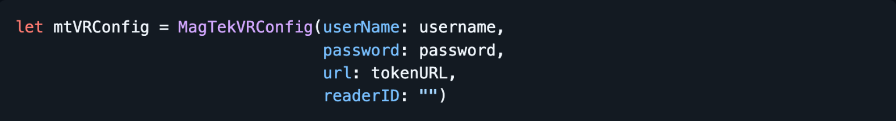
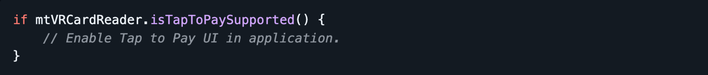
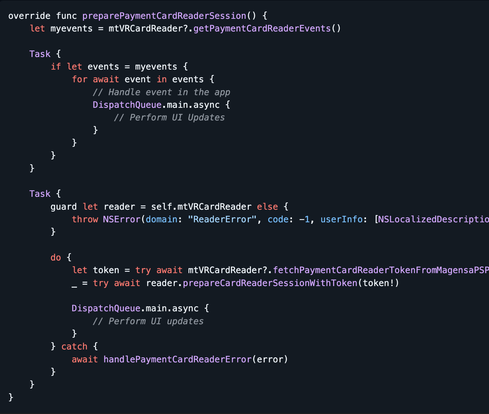
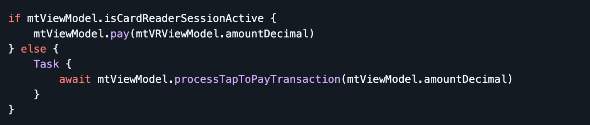

# MagTek Virtual Reader iOS SDK Code & Integration Guide 

[Accept contactless in-person payments using Tap to Pay on iPhone with the Magensa Payment Protection Gateway (MPPG). This repository includes a sample app and integration notes to help you get](https://www.magtek.com/product/mppg-services) running quickly.

# Table of contents

- Requirements

- Installation

- Configuration

- Run and Test

- Best Practices

- Terms and Conditions

- License

## Requirements

- iOS: 17.4+

- Devices: iPhone models that support Tap to Pay on iPhone (physical device required; simulator is not supported)

- Xcode: 15+ (recommend latest stable)

- Account: MPPG v5 with Unigate Pilot account is required. If you don't have a Pilot account, please contact your Magtek Sales Professional to have one created.

ℹ If your app targets iOS versions older than 17.4, you can still compile, but the Tap to Pay on iPhone flows will be runtime-gated to supported OS/device versions.

## Installation

- Download the latest MagTek Virtual Reader iOS SDK

- Drag the framework into your Xcode project and set Embed & Sign.

- For Action select “Copy files to destination”.

- For Target select your application.

- Add the ProximityReader.framework

## Configuration

The high level flow of the sample app is outlined below.

- Initialize MagTekVRConfig with MPPG username, MPPG password and tokenURL:

> 

- Initialize MagTekVRCardReader with configuration.

- After initialization is complete, perform a check to verify the device supports Tap to Pay. Only

enable Tap to Pay UI and functionality if the device supports Tap to Pay. Tap to Pay is not supported on iPads or older iOS devices.

- In order to process payments you must initialize a valid session. This is a simplified version of the code in the sample app:

- If there are no session initialization errors, you are ready to perform payment transactions. Before making a payment request verify the session is active. In the sample code this is done via the magTekVRViewModel

## Run and Test

- Connect a physical iPhone to your Mac.

- Open the sample project in Xcode and Run on device.

- Enter a test amount and choose Tap to Pay.

- Follow on-device prompts to complete a contactless transaction.

You’ll see success/failure states and basic logging in the sample UI.

## Best Practices

- Do not hardcode MPPG credentials or store them in UserDefaults.

- Use Keychain for tokens/secrets.

- Error handling: Show user-friendly errors; capture SDK diagnostics in development builds only.

## Terms and Conditions

[Terms and Conditions](https://www.magtek.com/about/policy?tab=terms)

## License

[License](https://www.magtek.com/about/policy?tab=software)
