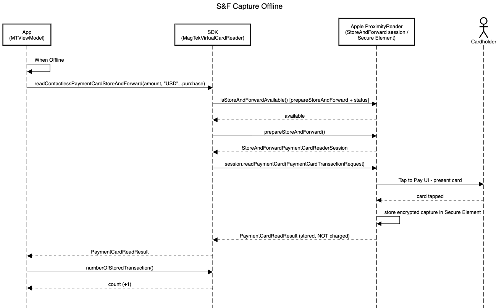
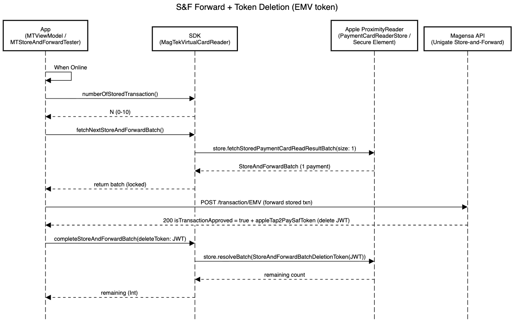
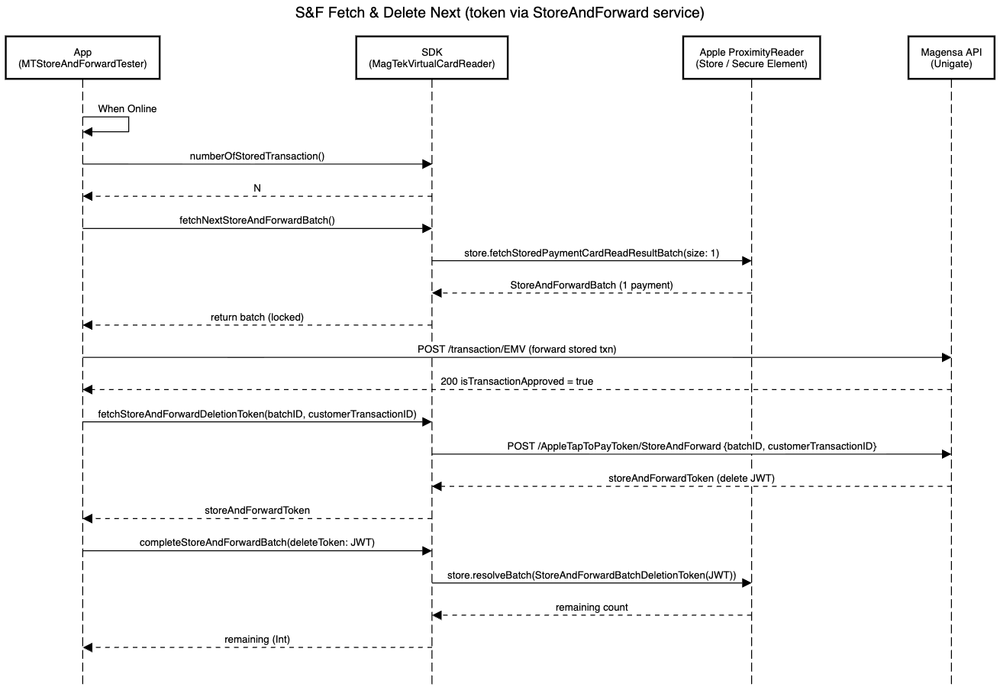
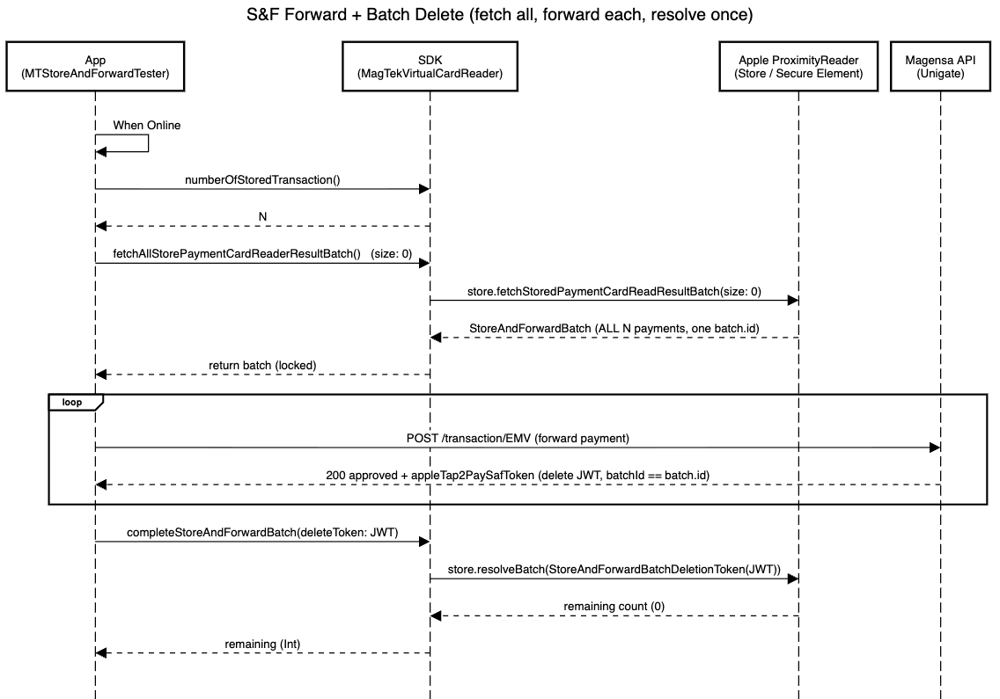
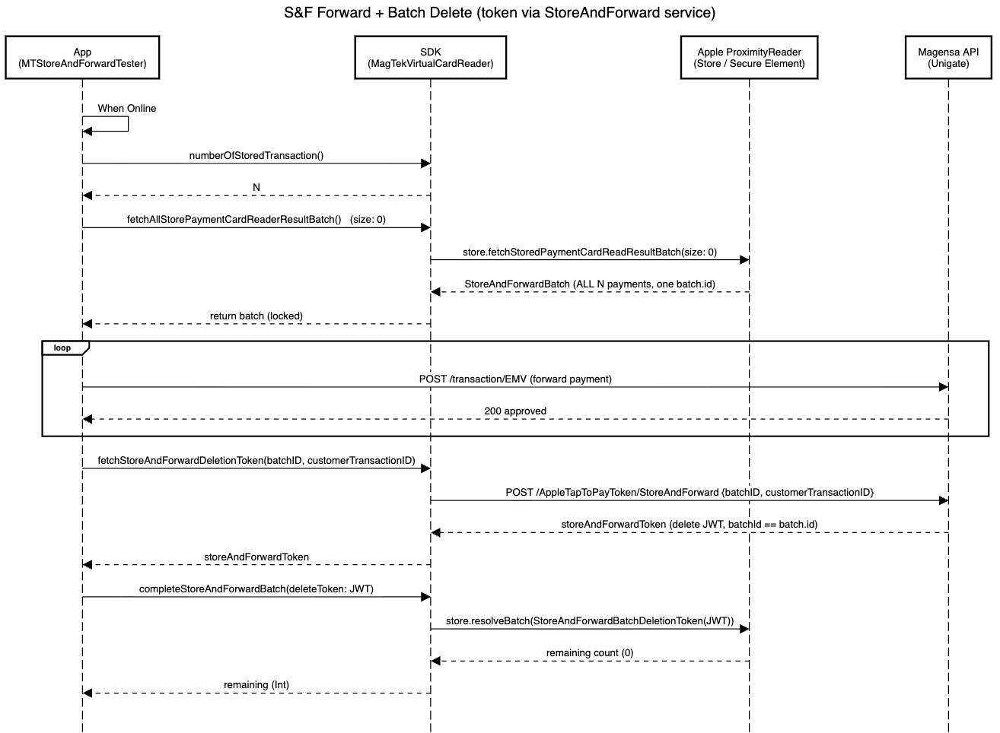

- [Apple Tap to Pay on iPhone Quickstart Guide](Documentation/Apple%20Tap%20to%20Pay%20on%20iPhone%20Quickstart%20guide/Apple%20Tap%20to%20Pay%20on%20iPhone%20Quickstart%20guide.md)

- [MagTek Virtual Reader iOS SDK](Documentation/MagTek%20Virtual%20Reader%20iOS%20SDK/MagTek-Virtual-Reader-iOS-SDK.md)

- [MagTek Virtual Reader User Guide](Documentation/MagTek%20Virtual%20Reader%20User%20Guide/MagTek%20Virtual%20Reader%20User%20Guide.md)

- [MagTek Virtual Reader Overview](Documentation/MagTek%20Virtual%20Reader%20Overview/MagTek%20Virtual%20Reader%20Demo%20-%20Overview.md)

## Store and Forward Diagrams

### Capture Offline

### Delete Token via EMV

### Delete Token via Store and Forward Service

### Fetch and Delete All via EMV

### Fetch and Delete All via Store and Forward Service

